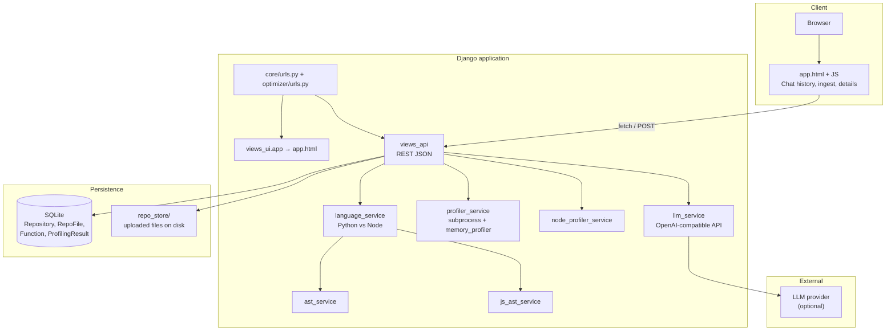

# Memory Profiler Optimizer

Production-minded **Django** app that ingests a **single source file**, extracts callable units, profiles memory (and timing), optionally **optimizes** them with an **LLM**, and lets you **compare**, **accept/reject**, and **download** updated code. The main UI is a **single HTML template** with vanilla JavaScript (no frontend build step).

## What you can do

- **Ingest** one file: `.py`, `.js`, `.ts`, `.jsx`, or `.tsx` (stored under `repo_store/` on disk; metadata in **SQLite**).
- **Chat history** sidebar lists past uploads by **original filename** (each ingest is a stored session).
- Browse **files** → **functions** → open **details** (original vs optimized code, KPIs, memory chart).
- Run **profile → LLM optimize → re-profile** and compare peak memory, execution time, and improvement.
- **Accept** or **reject** an optimization; on accept, download the updated file when the API provides a link.

## Architecture

The diagram below is valid [Mermaid](https://mermaid.js.org/) syntax (renders on GitHub, GitLab, many IDEs, and documentation sites).



**Request flow (high level):** the UI calls JSON endpoints under the same origin (`/repos`, `/files/…`, `/functions/…`, `/function/…`, `/optimize/…`, ingest, download, chart). Ingest writes the file to `repo_store`, creates `Repository` (display name = uploaded filename), `RepoFile`, and `Function` rows. Profiling uses a **Python subprocess** for `.py` (hard timeout) and Node-side tooling for JS/TS where applicable.

## Setup

```bash
python -m venv .venv
.venv\Scripts\activate
pip install -r requirements.txt
python manage.py migrate
python manage.py runserver
```

Open the app: **http://127.0.0.1:8000/**

Copy `.env.example` to `.env` and adjust variables as needed.

## LLM configuration

Set either OpenAI-style env vars or the generic `LLM_*` aliases:

- `OPENAI_API_KEY` (or `LLM_API_KEY`)
- `OPENAI_MODEL` (or `LLM_MODEL`) , default: `gpt-4o-mini`
- `OPENAI_BASE_URL` (or `LLM_BASE_URL`) , optional for OpenAI-compatible providers

## API (main app)

All of these are served from the same Django server (paths are relative to the site root).

| Action | Method | Path |
|--------|--------|------|
| List sessions | `GET` | `/repos` |
| Ingest file | `POST` | `/repos/ingest/file` (multipart field: `file`) |
| List files in session | `GET` | `/files/<repo_id>` |
| List functions in file | `GET` | `/functions/<file_id>` |
| Function detail + profiles | `GET` | `/function/<fn_id>` |
| Run optimizer | `POST` | `/optimize/<function_id>` |
| Accept / reject | `POST` | `/function/<fn_id>/decision` body: `{"action": "accept" \| "reject"}` |
| Memory chart PNG | `GET` | `/function/<fn_id>/memory-chart.png` |
| Download file | `GET` | `/file/<file_id>/download` |

Additional routes exist in `optimizer/urls.py` (e.g. merged/optimized file helpers) for advanced use.

## Legacy / Phase 1

- **`/phase1/`** , older exploratory UI and related **`/api/...`** routes in `core/views.py` (zip/GitHub-era surface area).
- **GitHub ingestion** is removed; GitHub-style endpoints respond with **HTTP 410** where applicable.

Prefer the root **`/`** UI and the **`/repos`…** API above for current work.

## Safety / sandboxing

- Python profiling runs in a **separate process** with a **hard timeout** (see `profiler_service`).
- The stack only auto-profiles callables that can be invoked **with no arguments** (best-effort).
- This is **not** a hardened sandbox: executed code can still perform harmful actions. For untrusted code, use OS- or container-level isolation and strict filesystem/network policy.

## Tech stack

- **Django** 5.2+, **SQLite**, **memory-profiler**, **matplotlib** (charts), **openai** client, optional **LangGraph** in the broader repo.
- **No** npm/webpack build for the primary UI , static template + fetch.
